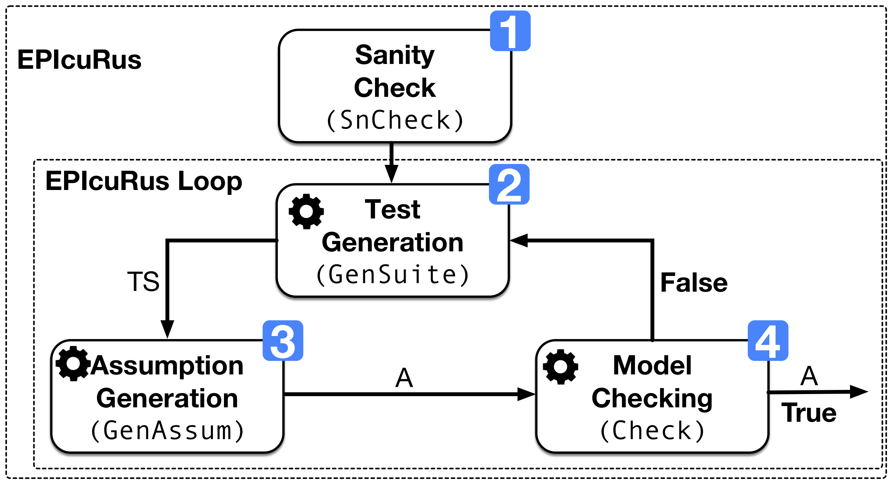

## EPIcuRus --- assumPtIon geneRation approach for CPS


<div align="center">

</div>

EPIcuRus (assumPtIon geneRation approach for CPS) is an assumption generation approach for CPS. EPIcuRus is a comprehensive solution for syntesizing environment assumptions for simulink models. EPIcuRus receives as input a software component and a requirement and automatically infers a set of conditions (i.e , an environment assumption) on the inputs of the model such that the model satisfies the requirement when its inputs are restricted by those conditions).


EPIcuRus proposes  combines machine learning and search-based testing to generate an environment assumption.
* Sanity check (1) verifies whether the requirement is satisfied for all possible inputs. If the requirement is neither satisfied nor violated for all possible inputs, EPIcuRus iteratively performs the three following steps:
* Search-based testing (2) automatically generates a set of test cases for exercising requirement such that some test cases are passing and some are failing.
* The machine learning algorithm (3) automatically infers an assumption using the test cases and their verdicts. This procedure offers three generation techniques: (DT) uses decision tree classification algorithm to generate assumption in the form of a decision tree ; (GP) uses genetic programming provided with a grammar to learn assumptions in form of syntactic trees; (RS) randomly generates an assumption which follow a grammar.
*  Model checking (4) verifies whether an environment assumption is sound by checking if the model restricted by the assumption guarantees the satisfaction of the property.

<div align="center">

</div>

## License

This software is released under GNU GENERAL PUBLIC LICENSE, Version 2. Please refer to the license.txt

# Publications

- <a href="https://orbilu.uni.lu/handle/10993/43473">Mining Assumptions for Software Components using Machine Learning</a> <br/>
<i>Gaaloul Khouloud, Menghi Claudio, Nejati Shiva, Lionel Briand, David Wolfe<br/>
European Software Engineering Conference and Symposium on the Foundations of Software Engineering (ESEC/FSE), 2020 <br/>
</i><br/>
- <a href="https://orbilu.uni.lu/handle/10993/47740">Combining Genetic Programming and Model Checking to Generate Environment Assumptions</a><br/>
<i>Gaaloul Khouloud, Menghi Claudio, Nejati Shiva, Lionel Briand, Yago Isasi Parache<br/>
IEEE Transactions on Software Engineering (TSE), 2021 <br/>
</i><br/>

## Content description

Folders
- ``GPutils``: contains side functions of GP learning algorithms
- ``DTutils``: contains side functions DT learning algorithms
- ``ModelChecking``: contains two python scripts: ``postprocessing.py`` is a Python script that is used by EPIcuRus to run QVtrace if the usage of the model checking tool is enabled;  ``postprocessing_timeout.py`` is the updated version of the former script where the limitations of QVtrace are addressed
- ``Evaluation``: contains functions that are used for EPIcuRus evaluation
- ``staliro``: contains the S-Taliro, the tool that is  used to automatically generate a test suite

- ``EpicurusMain``: contains the implementation of EPIcuRus main loop (``epicurus.m``), the implementation of the components (1), (2), (3) and (4) of EPIcuRus (``snCheck.m``, ``genSuite.m``, ``genAssum.m`` and ``modelCheck.m`` resp.) and the script for setting EPIcuRus options ( ``epicurus_options.m``).

``EpicurusMain`` folder contains three subfolders described as follows:
- ``Tutorial``: contains a tutorial that shows how EPIcuRus works on a demo model
- ``utils``: contains side functions for learning algorithms
- ``SearchTechniques``: contains the two functions; ``dtGenAssum.m ``  which runs EPIcuRus using DT and  ``gpGenAssum.m ``  which runs EPIcuRus using GP

## Prerequisite
- Matlab R2018a
- For mac users Xcode should be installed and properly configured (see https://www.mathworks.com/support/compilers )

## Installation instructions
- open the folder ``epicurus`` with Matlab
- add the folder ``epicurus`` and all of its subfolders on your classpath (right click on the folder > add to path > selected folder and subfolders)
- set the folder ``staliro`` as the current folder. Double-click the folder to make it the current folder.
- run the command ``setup_staliro``
- Install the Signal Processing Toolbox  to add it "Home > Adds On > Signal Processing Toolbox"

## Tutorial

The script ``tutorial.m`` under the forlder ``Tutorial`` demonstrates the steps to set and run EPIcuRus on our demo model. The model has four inputs, and the property of interest states that the output shall not be grater than 50 for more than 100 time frames.
The goal of the testing activity is to return the assumption on the inputs under which the property is always satisfied.

- Step 1- Open Matlab and add all the subfolders of the folder ``epicurus`` on your classpath (right click on the folder > add to path > selected folder and subfolders) <br/>
- Step 2- Set the folder ``Tutorial`` as the current folder.<br/>
- Step 3- choose whether you want to enable or disable QVtrace
1. To disable QVtrace  set the following option to false: <br/>
``epicurus_opt.qvtraceenabled=false;``<br/>
In Step 4, EPIcuRus stops the iterations when the maximum number of iterations is reached
2. To enable QVtrace set the following option to true: <br/>
``epicurus_opt.qvtraceenabled=true;``<br/>
Make sure to write the text Matlab in the text file ``turn.txt``.
EPIcuRus stops the iterations when the QVtrace check returns a valid assumption
- Step 4- To run the tutorial using GP, set ``learningMethod='GP';`` and ``GPalgorithm='GP';``. To run the tutorial using RS, set ``learningMethod='GP';`` and ``GPalgorithm='RS';``. To run the tutorial using DT set ``learningMethod='DT';``
- Step 5- In the Matlab command, execute the script ``tutorial.m`` by running the command  ``tutorial()`` <br/>
- Step 4- The results of the experiments are saved under``epicurus/result`` <br/>

By running the these commands, EPIcuRus performs iterations where at each iteration, a test suite is generated and an assumption is learned using decision trees. If the model checking is enabled, this assumption is checked using QVtrace.


## Running EPIcuRus on a Simulink model

To run EPIcuRus on a particular Simulink model, Step 3 should be created as follows: <br/>
Under the folder ``Tutorial``, perform the following steps:<br/>

1. Add the Simulink model (.slx) and the mat file .<br/>
2. If QVtrace is enabled,
- you must also specify the property using QCT query language. The QCT language is a logical predicate language used in QVtrace to specify the property of interest. Here is an example of a simple property specified in QCT:<br/>
Property (natural language): The output ``yawCmd2`` of the demo model shall be always less than 50<br/>
Specification (QCT language): ``yawCmd2 < 50;`` <br/>
For more details on how to use QVtrace and on the QCT query language, please contact: [QRA](https://qracorp.com) <br/>
- Add the property specified in QCT language to a QCT. The file name should follow the form:  ``demoRoriginal.qct`` where ``demo`` is the name of the model and ``R`` is the name of the property.<br/>
- Add a copy of the model in .mdl format.  the name of the model should follow the form: ``demoqv`` where ``demo`` is the name of the simulink model.<br/>
3. Create a matlab file under Tutorial with the following commands (see and follow``tutorial.m``): <br/>

% Defines the variables that contains the model information <br/>
```model='demo';```             % the model name  <br/>
```property='R';```             % the property name  <br/>
```input_names={'rollCmd_','yawCmd', 'beta_deg', 'vtas_kts','roll','yaw'};```            % a cell array of input names <br/>
```input_range=[0 50;0 50;0 10;0 10;0 50;0 50;];```            % an array of inputs ranges  <br/>
```categorical=[];```           % if categorical inputs exist, specify their index  <br/>
```init_cond = [];```           % default initial conditions of the model  <br/>
```sim_time=1;```           % the simulation Time<br/>

% Defines the property of interest. For more details run ``help tp_taliro`` <br/>
```phi='<>_[0,100](p1)';``` <br/>
```preds(1).str='p1';``` <br/>
```preds(1).A=[1 0]; ```<br/>
```preds(1).b=50; ``` <br/>

% Creates the options of EPIcuRus. For more details see ``epicurus_options.m `` <br/>
```epicurus_opt=epicurus_options();```

```epicurus_opt.assumeStartRun=1;```          % the EPIcuRus start run index  <br/>
```epicurus_opt.assumeEndRun=10;```          % the EPIcuRus end run index  <br/>
```epicurus_opt.assumeIterations= 30;```            % the maximum number of iterations  <br/>
```epicurus_opt.testSuiteSize=30;```             % the test suite size  <br/>
```epicurus_opt.nbrControlPoints=1;```          % the number of control points <br/>
```epicurus_opt.policy='UR';```            % the test suite generation policy  <br/>
```epicurus_opt.qvtraceenabled=false;```            % enable QVtrace checking  <br/>
```epicurus_opt.learningMethod='GP';```            % the learning method among GP and DT  <br/>

% Sets the state of GP (i.e., the list of operators, the root type, the last id generated in a tree..)
```state.lastid=0;```            % initialises the id of the last learned assumption to 0 <br/>
```state.init=1;```            % the GP initializations flag  <br/>
```state.disjunctionsExist=1;```            % the option to allows or not the presence of disjunctions in learned assumptions <br/>
```state.depthnodes='1';```            % the GP tree generation method  <br/>
```state.idboolean=0;```            % the flag denoting that the model contains inputs of type boolean <br/>

% Creates the options of GP. For more details see ``gp_epicurus_options.m `` <br/>
```gp_epicurus_opt=gp_epicurus_options();```

```gp_epicurus_opt.gen_size=100;```         % the generation size (e.g., the number of generations)  <br/>
```gp_epicurus_opt.pop_size=500;```         % the population size
```gp_epicurus_opt.max_depth=5;```           % The maximum depth of the generated assumption tree
```gp_epicurus_opt.maxNbrConj=4;```         % the maxinum number of conjunctions of an assumption
```gp_epicurus_opt.maxNbrDisj=3;```         % the maximum number of dijunctions of an assumption
```gp_epicurus_opt.sel_crt='tournamentSelection';```            % the selection mechanism
```gp_epicurus_opt.t_size=7;```         % the tournament size in case the selection mechanism = 'tournamentSelection'
```gp_epicurus_opt.init_Ratio=0.5;```           % the rate of the number of assumptions to save from the last population of the previous iteration to the intial population of the current iterationassumptions
```gp_epicurus_opt.algorithm='GP';```           % the algorithm among 'GP' and 'RS'

% Specifies the running script name and results folder name <br/>
```scriptname=[model,property];``` <br/>
```policyFolder=strcat('result',filesep,model,filesep,property,filesep,policy);``` <br/>
```algorithmFolder=strcat('result',filesep,model,filesep,property,filesep,policy,GPalgorithm);``` <br/>
```propertyFolder=strcat('result',filesep,model,filesep,property);``` <br/>
```modelFolder=['result',filesep,model]``` <br/>

% Creates the results folders <br/>
```mkdir(modelFolder);``` <br/>
```mkdir(propertyFolder);``` <br/>
```mkdir(policyFolder);``` <br/>
```mkdir(algorithmFolder);``` <br/>

% Runs EPIcuRus <br/>
```epicurus(model,property,init_cond,phi,preds,sim_time,input_names,categorical,input_range,epicurus_opt,gp_epicurus_opt,scriptname, resultfilename,algorithmFolder,state);``` <br/>


